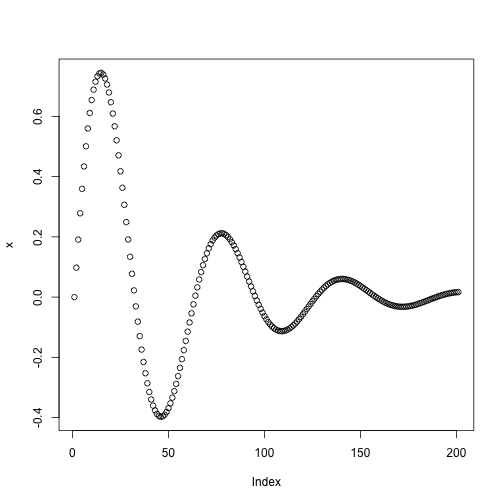
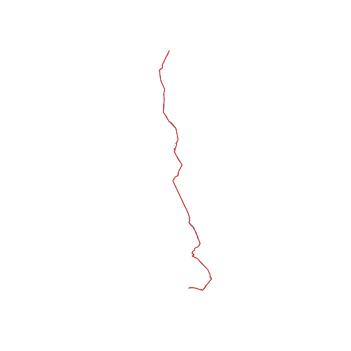

R and Spatial Data
========================================================

## Spatial Data in R

In any data analysis project, spatial or otherwise, it is important to have a strong 
understanding of the dataset before progressing. This section will therefore begin with 
a description of the input data used in this section. We will see how data can 
be loaded into R and exported to other formats, before going into more detail about the 
underlying structure of spatial data in R: how it 'sees' spatial data is quite unique.

### Loading spatial data in R

In most situations, the starting point of spatial analysis tasks is 
loading in pre-existing datasets. These may originate from government agencies, 
remote sensing devices or 'volunteered geographical information' from GPS devices, 
online databases such as Open Street Map or geo-tagged social media (Goodchild 2007).
In any case, the diversity of geographical data formats is large. 

R is able to import a very wide range of spatial data formats thanks to its
interface with the Geospatial Data Abstraction Library (GDAL), which is 
enabled by loading the package `rgdal` into R. Below we will
load data from two spatial data formats: GPS eXchange (`.gpx`)
and an ESRI Shapefile (consisting of at least files 
with `.shp`, `.shx` and `.dbf` extensions).

`readOGR` is in fact cabable of loading dozens more file formats, 
so the focus is on the *method* rather than the specific formats. 
The 'take home message' is that the `readOGR` function is capable 
of loading most common spatial file formats, but behaves differently depending on file type.
Let's start with a `.gpx` file, a tracklog recording a bicycle ride from Sheffield
to Wakefield which was uploaded Open Street Map. [!!! more detail?]


```r
# download.file('http://www.openstreetmap.org/trace/1619756/data', destfile
# = 'data/gps-trace.gpx')
library(rgdal)  # load the gdal package
```

```
## Loading required package: sp
## rgdal: version: 0.8-10, (SVN revision 478)
## Geospatial Data Abstraction Library extensions to R successfully loaded
## Loaded GDAL runtime: GDAL 1.10.0, released 2013/04/24
## Path to GDAL shared files: /usr/share/gdal/1.10
## Loaded PROJ.4 runtime: Rel. 4.8.0, 6 March 2012, [PJ_VERSION: 480]
## Path to PROJ.4 shared files: (autodetected)
```

```r
ogrListLayers(dsn = "data/gps-trace.gpx")  # which layers are available?
```

```
## [1] "waypoints"    "routes"       "tracks"       "route_points"
## [5] "track_points"
```

```r
shf2lds <- readOGR(dsn = "data/gps-trace.gpx", layer = "tracks")  # load track
```

```
## OGR data source with driver: GPX 
## Source: "data/gps-trace.gpx", layer: "tracks"
## with 1 features and 12 fields
## Feature type: wkbMultiLineString with 2 dimensions
```

```r
plot(shf2lds)
shf2lds.p <- readOGR(dsn = "data/gps-trace.gpx", layer = "track_points")  # load points
```

```
## OGR data source with driver: GPX 
## Source: "data/gps-trace.gpx", layer: "track_points"
## with 6085 features and 26 fields
## Feature type: wkbPoint with 2 dimensions
```

```r
points(shf2lds.p[seq(1, 3000, 100), ])
```

 


There is a lot going on in the preceding 7 lines of code, including functions that 
you are unlikely to have encountered before. Let us think about what has happened, line-by-line.

First, we used R to *download* a file from the internet, using the function `download.file`.
The two essential arguments of this function are `url` (we could have typed`url =` before the link) 
and `destfile` (which means destination file). As with any function, more optional arguments 
can be viewed by typing `?download.file`. 

When `rgdal` has succesfully loaded, the next task is not to import the file directly, 
but to find out which *layers* are available to import, with the function `ogrListLayers`.
The output from this command tells us that various layers are available, including
`tracks` and `track_points`, which we subsequently load using `readOGR`.
The basic `plot` function is used to plot the newly imported objects, ensuring they make sense.
In the second `plot` function, we take a subset of the object (see section ... for more on this).

As stated in the help documentation (accessed by entering `?readOGR`), the `dsn =` argument 
is interpreted differently depending on the type of file used. 
In the above example, the filename was the data source name. 
To load Shapefiles, by contrast, the *folder* containing the data is used:


```r
lnd <- readOGR(dsn = "data/", "london_sport")
```


Here, the data is assumed to reside in a folder entitled `data` which in R's current 
working directory (remember to check this using `getwd()`). 
If the files were stored in the working 
directory, one would use `dsn = "."` instead. Again, it may be wise to plot the data that 
results, to ensure that it has worked correctly.
Now that the data has been loaded into R's own `sp` format, try interogating and 
plotting it, using functions such as `summary` and `plot`.

### The size of spatial datasets in R

Any data that has been read into R's *workspace*, which constitutes all 
objects that can be accessed by name and can be listed using the `ls()` function, 
can be saved in R's own data storage file type, `.RData`. Spatial datasets can get 
quite large and this can cause problems on computers by consuming all available 
random access memory (RAM) or
hard disk space available to the computer. It is therefore wise to understand 
roughly how large spatial objects are; this will also provide insight into 
how long certain functions will take to run. 

In the absence of prior knowledge, which of the two objects loaded in the 
previous section would be expected to take up more memory. One could 
hypothesise that the London borroughs represented by the object `lnd` would be
larger, but how much larger? We could simply look at the size of the associated 
files, but R also provides a function (`object.size`) for discovering how large objects loaded into
its workspace are:


```r
object.size(shf2lds)
```

```
## 103168 bytes
```

```r
object.size(lnd)
```

```
## 79168 bytes
```


Surprisingly, the GPS data is larger. To see why, we can find out how many 
*vertices* (points connected by lines) are contained in each dataset:


```r
sapply(lnd@polygons, function(x) length(x))
```

```
##  [1] 1 1 1 1 1 1 1 1 1 1 1 1 1 1 1 1 1 1 1 1 1 1 1 1 1 1 1 1 1 1 1 1 1
```

```r
x <- sapply(lnd@polygons, function(x) nrow(x@Polygons[[1]]@coords))
sum(x)
```

```
## [1] 1102
```

```r

sapply(shf2lds@lines, function(x) length(x))
```

```
## [1] 1
```

```r
sapply(shf2lds@lines, function(x) nrow(x@Lines[[1]]@coords))
```

```
## [1] 6085
```


It is quite likely that the above code little sense at first; the important thing
to remember is that for each object we performed two functions: 1) a check that 
each line or polygon consists only of a single *part* (that can be joined to attribut data)
and 2) the use of `nrow` to count the number of vertices. The use of the `@` symbol should 
seem strange - its meaning will become clear in the section !!!. (Note also that the 
function `fortify`, discussed in section !!!, can also be used to extract the vertice count of 
spatial objects in R.)

Without worrying,
for now, about how these vertice counts were performed, it is clear that the GPS data 
has almost 6 times the number of vertices as does the London data, explaining its larger size.
Yet when plotted, the GPS data does not seem more detailed, implying that 
some of the vertices in the object are not needed for visualisation at the scale of 
the objects *bounding box*. 

### Simplifying geometries

The wastefulness of the GPS data for visualisation (the full dataset may
be useful for other types of analysis) raises the question following question: 
can the object be simplified such that its key features
features remain while substantially reducing its size? The answer is yes.
In the code below, we harness the 
power of the `rgeos` package and its `gSimplify` function to simplify 
spatial R objects (the code can also be used to simplify polygon geometries):


```r
library(rgeos)
```

```
## rgeos version: 0.2-19, (SVN revision 394)
##  GEOS runtime version: 3.3.8-CAPI-1.7.8 
##  Polygon checking: TRUE
```

```r
shf2lds.simple <- gSimplify(shf2lds, tol = 0.001)
object.size(shf2lds.simple)/object.size(shf2lds)
```

```
## 0.0304745657568238 bytes
```

```r
plot(shf2lds.simple)
plot(shf2lds, col = "red", add = T)
```

 


In the above block of code, `gSimplify` is given the object 
`shf2lds` and the `tol` argument, short for "tolerance",
is set at 0.001 (much larger values may be needed, for
data that use is *projected* - does not use latitude and longitude).
The comparison between the simplified object and the orginal shows 
that the new object is less than a third of its original size. 
Yet when visualised using the `plot` function, it is clear that 
`shf2lds.simple` retains the overall shape of the line and is virtually
indistinguishable from the orginal object.

This example is rather contrived because even the larger object 
`shf2lds` is only 0.103 Mb, 
negligible compared with the gigabytes of RAM available to modern computers. 
However, it underlines a wider point: for *visualisation* purposes at 
small spatial scales (i.e. covering a large area of the Earth on a small map), 
the *geometries* associated with spatial data can often be simplified to 
reduce processing time and usage of RAM. The other advantage of simplification 
is that it reduces the size occupied by spatial datasets when they are saved.

### Saving and exporting spatial objects


## The structure of spatial data in R

### Spatial* data

#### Points

#### Lines

#### Polygons

#### Grids and raster data

### Simplifying spatial data with `fortify`

## The main spatial packages

### sp

### rgdal

### rgeos

## Maps with ggplot2

### Adding base maps with ggmap

## Manipulating spatial data

### Coordinate reference systems and transformations

### Attribute joins

### Spatial joins

### Aggregation

### Clipping
