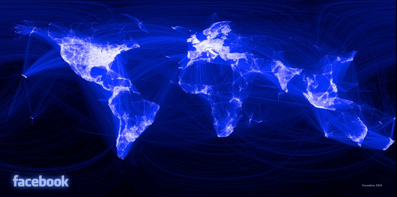

Introduction
============

What is R?
----------

R is a free and open source computer program that runs on all major
operating systems. It relies primarily on the *command line* for data
input: instead of interacting with the program by clicking on different 
parts of the screen, so users enter commands
via the keyboard. This will seem to strange to people accustomed to
relying on a graphical user interface (GUI) for most of their computing, yet the
approach has a number of benefits, as highlighted by Gary Sherman (2008,
p. 283), developer of the popular Geographical Information System (GIS) QGIS:

> With the advent of “modern” GIS software, most people want to point
> and click their way through life. That’s good, but there is a
> tremendous amount of flexibility and power waiting for you with the
> command line. Many times you can do something on the command line in a
> fraction of the time you can do it with a GUI.

The joy of this, when you get accustomed to it, is that any command is
only ever a few keystrokes away, and the order of the commands sent to R
can be stored and repeated in scripts, saving time in the
long-term and ensuring reproducible results (see "R and reproducible research").

Another important attribute of R, related to its command line interface,
is that it is a fully fledged *programming language*. Other GIS programs
are written in lower level languages such as C++ which are kept at a
safe distance from the users by the GUI. In R, by contrast, the user inputs is the same
as what R sees when it processes the request. Access to
R's source code and openness about how it works has enabled a veritable
army of programmers to improve R over time and add an incredible number
of extensions to its capabilities. There
are now more than 4000 official packages for R, allowing it to tackle
almost any computational or numerical problem one could imagine.

Although writing R source code and creating new packages will not appeal
to most R users, it inspires confidence to know that there is a strong
and highly skilled community of R developers. If there is a useful
function that R cannot currently perform, there is a reasonable
chance that someone is working on a solution that will become available
at a later date. One area
where extension of R's basic capabilities has been particularly
successful is the addition of a wide variety of spatial tools.

Why R for spatial data visualisation?
-------------------------------------

Aside from confusion surrounding its one character name [1] and 
uncertainty about how to search for help [2],
R may also seem a strange choice for a tutorial on
*spatial* data visualisation specifically. "I thought R was just for
statistics?" and "Why not use a proper GIS package like ArcGIS?" are valid
questions.

R was conceived - and is
still primarily known - for its capabilities as a "statistical programming language" (Bivand
and Gebhardt 2000). 
Statistical analysis functions remain core to the package but there is a
broadening of functionality to reflect a growing user base across disciplines.
R has become "an integrated suite of software facilities for data manipulation,
calculation and graphical display" (Venables et al. 2013). 
Spatial data analysis and visualisation is an important growth area within this 
increased functionality.
In recent years R has really made its mark as a data visualisation tool. 
The map of Facebook friendships produced by Paul Butler is iconic in this regard, 
and reached a global audience. 
He mapped the linkages between friends by calculating the great 
circle arcs between them (using the `geosphere` package) 
and plotted the result, displayed in figure 1. The secret to the success of this map
was the time taken to select the appropriate colour palette,
line widths and transparency for the plot. 
As we discuss in Section 3 the importance of these cannot be understated 
and are the difference between a stunning graphic and an impenetrable mess.

The impact of the graphic was to inspire the R community to produce more ambitious
graphics; a process fuelled by the increased demand for data visualisation and the
development of sophisticated packages, such as ggplot2, that augment the basic plot
functions of R. It is now the case that R has become a key analysis and visualisation
tool used by the likes of Twitter, the New York Times and Facebook and thousands of
consultants, design houses and journalists. It is not longer the preserve of academic 
research, with many graduate jobs listing R as a desirable skill. 

Finally, it is worth noting that while dedicated GIS programs handle spatial data by default and
display the results in a single way, there are various options in R that
must be decided by the user, for example whether to use R's base
graphics or a dedicated graphics package such as ggplot2. On the other
hand, the main benefits of R for spatial data visualisation lie in the
*reproducibility* of its outputs, a feature that we will be using to
great effect in this tutorial.

### R and reproducible research

There is a drive towards transparency in data and methods datasets in academic publishing. 
R encourages truly transparent and reproducible research by enabling anyone with an 
R installation reproduce results described in a previous paper. 
This process is eased by the RStudio integrated development environment (IDE) 
that allows 'live' R code and results to be embedded in documents. 
In fact, this tutorial was written in RStudio and can be recompiled on 
any computer by downloading the project's GitHub repository.

## Getting started with the tutorial

The first stage with this tutorial is to download the data from GitHub, 
where an updated version is stored: [github.com/geocomPP/sdvwR](https://github.com/geocomPP/sdvwR). 
Click on the "Download ZIP" button on the right, and unpack the folder to a sensible place
on your computer (e.g. the Desktop). Explore the folder and try opening some of the files, 
especially those from the sub-folder entitled "data": these are the input datasets we'll be using.

For the purpose of this practical we recommend the RStudio integrated development 
environment (IDE), which is specifically designed for enabling productivity using R.

