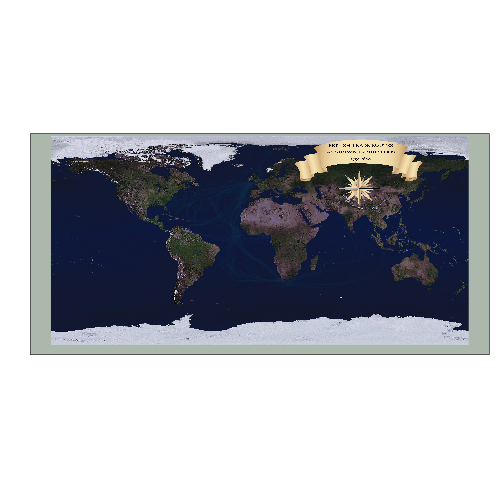
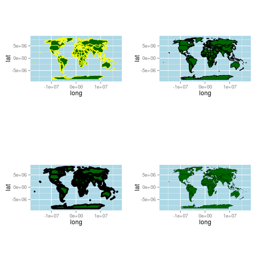
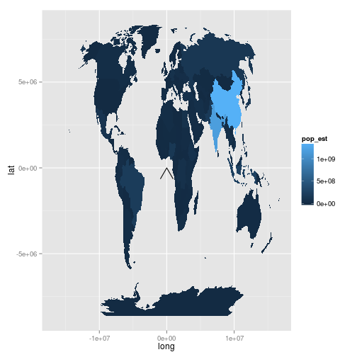

Introduction
============

What is R?
----------

R is a free and open source computer program that runs on all major
operating systems. R relies primarily on a *command line* interface for
data input: instead of interacting with the program by moving your mouse
around clicking on different parts of the screen, users enter commands
via the keyboard. This will seem to strange to people accustomed to
relying on a graphical user interface (GUI) for most of their computing,
e.g. via popular programs such as Microsoft Excel or SPSS, yet the
approach has a number of benefits, as highlighted by Gary Sherman (2008,
p. 283), developer of the popular GIS program QGIS:

> With the advent of “modern” GIS software, most people want to point
> and click their way through life. That’s good, but there is a
> tremendous amount of flexibility and power waiting for you with the
> command line. Many times you can do something on the command line in a
> fraction of the time you can do it with a GUI.

The joy of this, when you get accustomed to it, is that any command is
only ever a few keystrokes away, and the order of the commands sent to R
can be stored and repeated in scripts, saving even more time in the
long-term (more on this in section ...).

Another important attribute of R, related to its command line interface,
is that it is a fully fledged *programming language*. Other GIS programs
are written in lower level languages such as C++ which are kept at a
safe distance from the users by the GUI. In R, by contrast, the user is
'close to the metal' in the sense that what he or she inputs is the same
as what R sees when it processes the request. This 'openness' can seem
raw and daunting to beginners, but it is vital to R's success. Access to
R's source code and openness about how it works has enabled a veritable
army of programmers to improve R over time and add an incredible number
of extensions to its base capabilities. Consider for a moment that there
are now more than 4000 official packages for R, allowing it to tackle
almost any computational or numerical problem one could image, and many
more that one could not!

Although writing R source code and creating new packages will not appeal
to most R users, it inspires confidence to know that there is a strong
and highly skilled community of R developers. If there is a useful
spatial function that R cannot currently perform, there is a reasonable
chance that someone is working on a solution that will become available
at a later date. This constant evolution and improvement is a feature of
open source software projects not limited to R, but the range and
diversity of extensions is certainly one of its strong points. One area
where extension of R's basic capabilities has been particularly
successful is the addition of a wide variety of spatial tools.

The rise of R's spatial capabilities
------------------------------------

!!! Quick history of R's spatial packages emphasizing current growth and
heavy dependence on sp.

Mention exciting and recently added packages.

Why R for spatial data visualisation?
-------------------------------------

Aside from confusion surrounding its one character name - "what kind of
a name is R?" [1] and "how can you possibly find resources for R
online?" [2] - R may also seem a strange choice for a chapter on
*spatial* data visualisation specifically. "I thought R was just for
statistics?" and "Why not use a proper GIS package like QGIS?" are valid
questions.

The first question arises because R was traditionally conceived - and is
still primarily known - as a "statistical programming language" (Bivand
and Gebhardt 2000). Although R does have cutting edge statistical
capabilities, this definition does not do justice to its power and
flexibility. Thus, a more accurate albeit longer definition of R is "an
integrated suite of software facilities for data manipulation,
calculation and graphical display" (Venables et al. 2013). It is
important to consider this wider definition before diving into R: it is
a fully fledged programming language meaning that it is highly
extensible but also that the same result can often be generated in
different ways. This can be confusing.

The second question is based on the premise that all 'proper' Geographic
Information Systems need to operate in the same way, with primacy
allocated to a mapping window and a mouse-driven GUI interface. But when
we look back at the history of GIS and its definitions, it becomes clear
that R *is* fully fledged GIS, when it is set up correctly. All early
GIS programs used a command-line interface; GUIs were only developed
later as a way to run commands without needing to remember all the
command names (although this is largely overcome by good 'help' options
and auto-completion). A concise definition of a GIS is "a computerized
tool for solving geographic problems" (Longley et al. 2005, p. 16) and R
certainly enables this. A more expansive definition of GIS is "a
powerful set of tools for collecting, storing, retrieving at will,
transforming, and displaying spatial data from the real world for a
particular set of purposes" (Burrough and McDonnell, 1998, from Bivand
et al. 2013, p. 5); R excels at each of these tasks.

That being said, there are a few major differences between R and
conventional GIS programs in terms of spatial data visualisation: R is
more suited to creating one-off graphics than exploring spatial data
interactively on a map. Conventional GIS packages are better at repeated
zooming, panning and spatial sub-setting using custom-drawn polygons
than R. Use of the `locator` function allows some interactive selection
capabilities in R, but these are limited (Bivand et al. 2013, 3.4).
Although interactive maps in R can be created (e.g. using the web
interface `shiny`), R should not be seen as a direct replacement of
dedicated GIS programs, especially now that there are myriad free
options to try (Sherman 2008). One should use the program which is most
appropriate for the task: R can tackle almost any spatial visualisation
problem and may be the best option in many cases. In others, however, it
may be best used alongside other programs (e.g. Google Earth).

While dedicated GIS programs handle spatial data by default and display
the results in a single way, there are various options in R that must be
decided by the user. This can be daunting. For example, the user must
decide whether to use R's base graphics or a dedicated graphics package
such as ggplot2 for mapping. On the other hand, a major benefit of R is
that allows spatial and non-spatial analysis to occur in a *consistent*
and *cohesive* framework. Another benefit of R for spatial data
visualisation lies in the *reproducibility* of its outputs, a feature
that we will be using to great effect in this chapter.

R for Reproducible research
---------------------------

!!! Are all the examples going to be reproducible?

All these components - scripting, stability and the ability to embed
'live' code in documents - make R an excellent tool for transparent
research. By using R and carefully documenting what has been done, one
ensures that the methods used to reach a certain result can be
reproduced by anyone anywhere in the world, provided they have access to
the input dataset. The RStudio graphical interface with R encourages
good documentation. RStudio enables presentations to be created and
professional-quality pdf documents to be produced using the custom file
formats `.Rpres` and `.rnw`. In fact, this chapter was written in
RMarkdown and converted into a pdf document using only RStudio editor!

R in the wild
-------------

Examples of where R has had an important visual impact.

Might be good to mention New York Times etc here as key users of R.

An introductory session
-----------------------

The best way to learn to use a new tool is by using it. The metaphor of
craft skills is appropriate here: if you wanted to become skilled at
scything, for example, you would not spend your time reading about
scythes. The same is true of R: the best way to learn how it works is to
'get your hands dirty' and try it out on your own computer. This
introductory session will therefore serve as an introduction to R's
unque *syntax*, as well an illustration of how other visualisations
presented in this chapter can be reproduced.

R's syntax
----------

### Objects

### Functions and arguments

Most operations that are performed on objects are done using
*functions*. Understanding functions and their various *arguments* is
key to manipulating and visualising data in R: the more functions and
arguments you know, the more you will be able to do. Functions, in broad
terms, are operations that change objects in R from one thing to
another. In mathematical language, they *map* sets of numbers onto each
other. Arguments are the variables or parameters that are fed into
functions to alter their behavior. In terms of R's syntax, arguments are
separated by commas within the curved brackets that follow from the
function's name. A source of confusion with arguments can be that in
some cases they can be inserted directly, wheras in others R needs to be
told which argument is being referred to, as illustrated in the code
below:

~~~~ {.r}
seq(from = 0, to = 2, by = 0.5)
~~~~

    ## [1] 0.0 0.5 1.0 1.5 2.0

~~~~ {.r}
seq(0, 2, 0.5)
~~~~

    ## [1] 0.0 0.5 1.0 1.5 2.0

~~~~ {.r}

seq(0, 2, length.out = 6)
~~~~

    ## [1] 0.0 0.4 0.8 1.2 1.6 2.0

~~~~ {.r}
seq(0, 2, 6)
~~~~

    ## [1] 0

Before learning about specific functions for spatial analysis and
visualisation, it is worth taking some time to think about what a
function is and how the arguments passed to it affect how it works. The
function `plot` is a good example, because it can take many different
input datasets and arguments and produces very different results
depending on the arguments it is given. Let's start with a basic
example:

~~~~ {.r}
x <- 1:20
y <- 20 * x^2 - x^3
plot(x, y)
~~~~

In the above code, the funtion `plot` was given two arguments, `x` and
`y` and its default settings are to interpret these as values on a
cartesian coordinate system to plot.

Chapter overview
----------------

Map Production: Best Practice
=============================

Good maps depend on sound analysis and data preparation and can have an
enormous impact on the understanding and communication of results. It
has never been easier to produce a map. The underlying data required are
available in unprecedented volumes and the technological capabilities of
transforming them into compelling maps and graphics are increasingly
sophisticated and straightforward to use. Data and software, however,
only offer the starting points of good spatial data visualisation since
they need to be refined and calibrated by the researchers seeking to
communicate their findings. In this section we will run through the
features of a good map. We will then seek to emulate them with R in
Section XX. It is worth noting that not all good maps and graphics
contain all the features below – they should simply be seen as
suggestions rather than firm principles.

Effective map making is hard process – as Krygier and Wood (XXX) put it
“there is a lot to see, think about, and do” (p6). It often comes at the
end of a period of intense data analysis and perhaps when the priority
is to get a paper finished or results published and can therefore be
rushed as a result. The beauty of R (and other scripting languages) is
the ability to save code and simply re-run it with different data.
Colours, map adornments and other parameters can therefore be quickly
applied so it is well worth creating a template script that adheres to
best practice.

We have selected ggplot2 as our package of choice for the bulk of our
maps and spatial data visualisations because it has a number of these
elements at its core. The “gg” in its slightly odd name stands for
“Grammar of Graphics”, which is a set of rules developed by Leland
Wilkinson (2005) in a book of the same name. Grammar in the context of
graphics works in much the same way as it does in language- it provides
a structure. The structure is informed by both human perception and also
mathematics to ensure that the resulting visualisations are both
technically sound and comprehensible. Through creating ggplot2, Hadley
Wickham, implemented these rules as well as developing ways in which
plots can be built up in layers (see Wickham, 2010). This layering
component is especially useful in the context of spatial data since it
is conceptually the same as map layers in Geographical Information
Systems (GIS).

First load the libraries required for this section:

~~~~ {.r}
library(rgdal)
~~~~

    ## Loading required package: sp
    ## rgdal: version: 0.8-14, (SVN revision 496)
    ## Geospatial Data Abstraction Library extensions to R successfully loaded
    ## Loaded GDAL runtime: GDAL 1.9.0, released 2011/12/29
    ## Path to GDAL shared files: /usr/share/gdal/1.9
    ## Loaded PROJ.4 runtime: Rel. 4.7.1, 23 September 2009, [PJ_VERSION: 470]
    ## Path to PROJ.4 shared files: (autodetected)

~~~~ {.r}
library(ggplot2)
library(gridExtra)
~~~~

    ## Loading required package: grid

You will also need create a folder and then set it as your working
directory. Below we assume the name is `Uname`, and the folder is saved
as `sdvwR` in the Desktop in Windows.

~~~~ {.r}
setwd("c:/Users/Uname/Desktop/sdvwR")
~~~~

For this section we are going to use a map of the world to demonstrate
some of the cartographic principles discussed. A world map is available
from the Natural Earth website. The code below will download this and
save it to your working directory.

~~~~ {.r}
download.file(url = "http://www.naturalearthdata.com/http//www.naturalearthdata.com/download/110m/cultural/ne_110m_admin_0_countries.zip", 
    "ne_110m_admin_0_countries.zip", "auto")
unzip("ne_110m_admin_0_countries.zip", exdir = "data/")  # unzip to data folder
file.remove("ne_110m_admin_0_countries.zip")  # remove zip file
~~~~

    ## [1] TRUE

Once downloaded we can then load the data into the R console. We have
just downloaded a shapefile, which as Section XX explains, is not
handled as a "standard" data object in R.

~~~~ {.r}
wrld <- readOGR("data/", "ne_110m_admin_0_countries")
~~~~

    ## OGR data source with driver: ESRI Shapefile 
    ## Source: "data/", layer: "ne_110m_admin_0_countries"
    ## with 177 features and 63 fields
    ## Feature type: wkbPolygon with 2 dimensions

~~~~ {.r}
plot(wrld)
~~~~

To see the first ten rows of attribute information assocuiated with each
of the country boundaries type the following

~~~~ {.r}
head(wrld@data)
~~~~

You can see there are a lot of columns associated with this file.
Although we will keep all of the them, we are only really interested in
the population estimate ("pop\_est") field. Before progressing it is is
worth reprojecting the data in order that the population data can be
seen better. The coordinate reference system of the wrld shapefile is
currently WGS84. This the common latitude and longitude format that all
spatial software packages understand. From a cartographic perspective
the standard plots of this projection, of the kind produced above, are
not suitable since they distort the shapes of those countries further
from the equator. Instead the Robinson projection provides a good
compromise between areal distortion and shape preservation. We therefore
project it as follows.

~~~~ {.r}
library(geosphere)
wrld.rob <- spTransform(wrld, CRS("+proj=robin"))
plot(wrld.rob)
~~~~

"ESRI: 54030" is the reference code of the Robinson prjection in the
database of projections that R downloads with the rgdal package. You
will have spotted from the plot that the countries in the world map are
much better proportioned.

We now need to "fortify" this spatial data to convert it into a format
that ggplot2 understands, we also use "merge" to re-attach the attribute
data that is lost in the fortify operation.

~~~~ {.r}
# fortify requires rgeos or maptools packages - have we already loaded it?
# !!!
wrld.rob.f <- fortify(wrld.rob, region = "sov_a3")
~~~~

    ## Loading required package: rgeos
    ## rgeos version: 0.3-2, (SVN revision 413M)
    ##  GEOS runtime version: 3.3.3-CAPI-1.7.4 
    ##  Polygon checking: TRUE

~~~~ {.r}

wrld.pop.f <- merge(wrld.rob.f, wrld.rob@data, by.x = "id", by.y = "sov_a3")
~~~~

~~~~ {.r}
# continuous colour ramp

map <- ggplot(wrld.pop.f, aes(long, lat, group = group, fill = pop_est)) + geom_polygon() + 
    coord_equal() + labs(x = "Longitude", y = "Latitude", fill = "World Population") + 
    ggtitle("World Population")

# better colours with more breaks- to finish

map + scale_fill_continuous(breaks = c(10^c(8, 9)))
~~~~

~~~~ {.r}

# categorical variables
~~~~

Conforming to colour conventions
================================

Colour has an enormous impact on how people will percieve your graphic.
"Readers" of a map come to it with a range of pre-conceptions about how
the world looks. If the map's purpose is to clearly communicate data
then it is often advisable to conform to conventions so as not to
disorientate readers to ensure they can focus on the key messages
contained in the data. A good example of this is the use of blue for
bodies of water and green for landmass. The code example below generates
two plots with our wrld.pop.f object. The first colours the land blue
and the sea (in this case the background to the map) green and the
second is more conventional. We use the "grid.arrange" function from the
"gridExtra" package to display the maps side by side.

~~~~ {.r}
map2 <- ggplot(wrld.pop.f, aes(long, lat, group = group)) + coord_equal()

blue <- map2 + geom_polygon(fill = "light blue") + theme(panel.background = element_rect(fill = "dark green"))

green <- map2 + geom_polygon(fill = "dark green") + theme(panel.background = element_rect(fill = "light blue"))

grid.arrange(blue, green, ncol = 2)
~~~~

Experimenting with line colour and line widths
==============================================

In addition to conforming to colour conventions, line colour and width
offer important parameters, which are often overlooked tools for
increasing the legibility of a graphic. As the code below demonstrates,
it is possible to adjust line colour through using the "colour"
parameter and the line width using the "lwd" parameter. The impact of
different line widths will vary depending on your screen size and
resolution. If you save the plot to pdf (or an image) then the size at
which you do this will also affect the line widths.

~~~~ {.r}
map3 <- map2 + theme(panel.background = element_rect(fill = "light blue"))

yellow <- map3 + geom_polygon(fill = "dark green", colour = "yellow")

black <- map3 + geom_polygon(fill = "dark green", colour = "black")

thin <- map3 + geom_polygon(fill = "dark green", colour = "black", lwd = 0.1)

thick <- map3 + geom_polygon(fill = "dark green", colour = "black", lwd = 1.5)

grid.arrange(yellow, black, thick, thin, ncol = 2)
~~~~

There are other parameters such as layer transparency that can be
applied to all aspects of the plot - both points, lines and polygons -
that we will reference in later examples in this chapter.

Map Adornments and Annotations
==============================

Map adornments and annotations are essential to orientate the viewer and
provide context; they include graticules, north arrows, scale bars and
data attribution. Not all are required on a single map, indeed it is
often best that they are used sparingly to avoid unecessary clutter
(Monkhouse and Wilkinson, 1971). Unfortunately it is not always as
straightforward to add these in R, and perhaps less so using the ggplot2
paradigm, when compared to a conventional GIS. Here we will outline the
ways in which annotations can be added.

!!!! In the maps created so far, we have defined the *aesthetics* of the
map in the foundation function `ggplot`. The result of this is that all
subsequent layers are expected to have the same variables and
essentially contain data with the same dimensions as original dataset.
But what if we want to add a new layer from a completely different
dataset To do this, we must not add any arguments to the `ggplot`
function, only adding data sources one layer at a time:

North arrow
===========

~~~~ {.r}
ggplot() + geom_polygon(data = wrld.pop.f, aes(long, lat, group = group, fill = pop_est)) + 
    geom_line(aes(x = c(-160, -160), y = c(0, 25)), arrow = arrow())
~~~~

~~~~ {.r}

# scale bar- found this function

hscale_segment = function(breaks, ...) {
    y = unique(breaks$y)
    stopifnot(length(y) == 1)
    dx = max(breaks$x) - min(breaks$x)
    dy = 1/30 * dx
    hscale = data.frame(ix = min(breaks$x), iy = y, jx = max(breaks$x), jy = y)
    vticks = data.frame(ix = breaks$x, iy = (y - dy), jx = breaks$x, jy = (y + 
        dy))
    df = rbind(hscale, vticks)
    return(geom_segment(data = df, aes(x = ix, xend = jx, y = iy, yend = jy), 
        ...))
    
}

hscale_text = function(breaks, ...) {
    dx = max(breaks$x) - min(breaks$x)
    dy = 2/30 * dx
    breaks$y = breaks$y + dy
    return(geom_text(data = breaks, aes(x = x, y = y, label = label), hjust = 0.5, 
        vjust = 0, ...))
    
}
~~~~

There is an almost infinite number of different combinations of the
above parameters so take inspiration from maps and graphics you have
seen and liked. The process is an iterative one, it will take multiple
attempts to get right. Show your map to friends and colleagues- all will
have an opinion but don’t be afraid to stand by the decisions you have
taken.

Consistency- across papers.

R and Spatial Data
==================

Spatial Data in R
-----------------

In any data analysis project, spatial or otherwise, it is important to
have a strong understanding of the dataset before progressing. This
section will therefore begin with a description of the input data used
in this section. We will see how data can be loaded into R and exported
to other formats, before going into more detail about the underlying
structure of spatial data in R: how it 'sees' spatial data is quite
unique.

### Loading spatial data in R

In most situations, the starting point of spatial analysis tasks is
loading in pre-existing datasets. These may originate from government
agencies, remote sensing devices or 'volunteered geographical
information' from GPS devices, online databases such as Open Street Map
or geo-tagged social media (Goodchild 2007). The diversity of
geographical data formats is large.

R is able to import a very wide range of spatial data formats thanks to
its interface with the Geospatial Data Abstraction Library (GDAL), which
is enabled by loading the package `rgdal` into R. Below we will load
data from two spatial data formats: GPS eXchange (`.gpx`) and an ESRI
Shapefile (consisting of at least files with `.shp`, `.shx` and `.dbf`
extensions).

`readOGR` is in fact cabable of loading dozens more file formats, so the
focus is on the *method* rather than the specific formats. The 'take
home message' is that the `readOGR` function is capable of loading most
common spatial file formats, but behaves differently depending on file
type. Let's start with a `.gpx` file, a tracklog recording a bicycle
ride from Sheffield to Wakefield which was uploaded Open Street Map.
[!!! more detail?]

~~~~ {.r}
# download.file('http://www.openstreetmap.org/trace/1619756/data', destfile
# = 'data/gps-trace.gpx')
library(rgdal)  # load the gdal package
~~~~

    ## Loading required package: sp
    ## rgdal: version: 0.8-11, (SVN revision 479M)
    ## Geospatial Data Abstraction Library extensions to R successfully loaded
    ## Loaded GDAL runtime: GDAL 1.9.2, released 2012/10/08
    ## Path to GDAL shared files: /usr/share/gdal
    ## Loaded PROJ.4 runtime: Rel. 4.8.0, 6 March 2012, [PJ_VERSION: 480]
    ## Path to PROJ.4 shared files: (autodetected)

~~~~ {.r}
ogrListLayers(dsn = "data/gps-trace.gpx")  # which layers are available?
~~~~

    ## [1] "waypoints"    "routes"       "tracks"       "route_points"
    ## [5] "track_points"

~~~~ {.r}
shf2lds <- readOGR(dsn = "data/gps-trace.gpx", layer = "tracks")  # load track
~~~~

    ## OGR data source with driver: GPX 
    ## Source: "data/gps-trace.gpx", layer: "tracks"
    ## with 1 features and 12 fields
    ## Feature type: wkbMultiLineString with 2 dimensions

~~~~ {.r}
plot(shf2lds)
shf2lds.p <- readOGR(dsn = "data/gps-trace.gpx", layer = "track_points")  # load points
~~~~

    ## OGR data source with driver: GPX 
    ## Source: "data/gps-trace.gpx", layer: "track_points"
    ## with 6085 features and 26 fields
    ## Feature type: wkbPoint with 2 dimensions

~~~~ {.r}
points(shf2lds.p[seq(1, 3000, 100), ])
~~~~

There is a lot going on in the preceding 7 lines of code, including
functions that you are unlikely to have encountered before. Let us think
about what has happened, line-by-line.

First, we used R to *download* a file from the internet, using the
function `download.file`. The two essential arguments of this function
are `url` (we could have typed`url =` before the link) and `destfile`
(which means destination file). As with any function, more optional
arguments can be viewed by typing `?download.file`.

When `rgdal` has succesfully loaded, the next task is not to import the
file directly, but to find out which *layers* are available to import,
with the function `ogrListLayers`. The output from this command tells us
that various layers are available, including `tracks` and
`track_points`, which we subsequently load using `readOGR`. The basic
`plot` function is used to plot the newly imported objects, ensuring
they make sense. In the second `plot` function, we take a subset of the
object (see section ... for more on this).

As stated in the help documentation (accessed by entering `?readOGR`),
the `dsn =` argument is interpreted differently depending on the type of
file used. In the above example, the filename was the data source name.
To load Shapefiles, by contrast, the *folder* containing the data is
used:

~~~~ {.r}
lnd <- readOGR(dsn = "data/", "london_sport")
~~~~

Here, the data is assumed to reside in a folder entitled `data` which in
R's current working directory (remember to check this using `getwd()`).
If the files were stored in the working directory, one would use
`dsn = "."` instead. Again, it may be wise to plot the data that
results, to ensure that it has worked correctly. Now that the data has
been loaded into R's own `sp` format, try interogating and plotting it,
using functions such as `summary` and `plot`.

### The size of spatial datasets in R

Any data that has been read into R's *workspace*, which constitutes all
objects that can be accessed by name and can be listed using the `ls()`
function, can be saved in R's own data storage file type, `.RData`.
Spatial datasets can get quite large and this can cause problems on
computers by consuming all available random access memory (RAM) or hard
disk space available to the computer. It is therefore wise to understand
roughly how large spatial objects are; this will also provide insight
into how long certain functions will take to run.

In the absence of prior knowledge, which of the two objects loaded in
the previous section would be expected to take up more memory. One could
hypothesise that the London boroughs represented by the object `lnd`
would be larger, but how much larger? We could simply look at the size
of the associated files, but R also provides a function (`object.size`)
for discovering how large objects loaded into its workspace are:

~~~~ {.r}
object.size(shf2lds)
~~~~

    ## 107464 bytes

~~~~ {.r}
object.size(lnd)
~~~~

    ## 125544 bytes

Surprisingly, the GPS data is larger. To see why, we can find out how
many *vertices* (points connected by lines) are contained in each
dataset:

~~~~ {.r}
sapply(lnd@polygons, function(x) length(x))
~~~~

    ##  [1] 1 1 1 1 1 1 1 1 1 1 1 1 1 1 1 1 1 1 1 1 1 1 1 1 1 1 1 1 1 1 1 1 1

~~~~ {.r}
x <- sapply(lnd@polygons, function(x) nrow(x@Polygons[[1]]@coords))
sum(x)
~~~~

    ## [1] 1102

~~~~ {.r}

sapply(shf2lds@lines, function(x) length(x))
~~~~

    ## [1] 1

~~~~ {.r}
sapply(shf2lds@lines, function(x) nrow(x@Lines[[1]]@coords))
~~~~

    ## [1] 6085

It is quite likely that the above code little sense at first; the
important thing to remember is that for each object we performed two
functions: 1) a check that each line or polygon consists only of a
single *part* (that can be joined to attribut data) and 2) the use of
`nrow` to count the number of vertices. The use of the `@` symbol should
seem strange - its meaning will become clear in the section !!!. (Note
also that the function `fortify`, discussed in section !!!, can also be
used to extract the vertice count of spatial objects in R.)

Without worrying, for now, about how these vertice counts were
performed, it is clear that the GPS data has almost 6 times the number
of vertices as does the London data, explaining its larger size. Yet
when plotted, the GPS data does not seem more detailed, implying that
some of the vertices in the object are not needed for visualisation at
the scale of the objects *bounding box*.

### Simplifying geometries

The wastefulness of the GPS data for visualisation (the full dataset may
be useful for other types of analysis) raises the question following
question: can the object be simplified such that its key features
features remain while substantially reducing its size? The answer is
yes. In the code below, we harness the power of the `rgeos` package and
its `gSimplify` function to simplify spatial R objects (the code can
also be used to simplify polygon geometries):

~~~~ {.r}
library(rgeos)
~~~~

    ## rgeos version: 0.3-2, (SVN revision 413M)
    ##  GEOS runtime version: 3.3.9-CAPI-1.7.9 
    ##  Polygon checking: TRUE

~~~~ {.r}
shf2lds.simple <- gSimplify(shf2lds, tol = 0.001)
(object.size(shf2lds.simple)/object.size(shf2lds))[1]
~~~~

    ## [1] 0.04608

~~~~ {.r}
plot(shf2lds.simple)
plot(shf2lds, col = "red", add = T)
~~~~

In the above block of code, `gSimplify` is given the object `shf2lds`
and the `tol` argument, short for "tolerance", is set at 0.001 (much
larger values may be needed, for data that use is *projected* - does not
use latitude and longitude). Comparison between the sizes of the
simplified object and the orginal shows that the new object is less than
3% of its original size. Try plotting the orginal and simplified tracks
on your computer: when visualised using the `plot` function, it becomes
clear that the object `shf2lds.simple` retains the overall shape of the
line and is virtually indistinguishable from the orginal object.

This example is rather contrived because even the larger object
`shf2lds` is only 0.107 Mb, negligible compared with the gigabytes of
RAM available to modern computers. However, it underlines a wider point:
for *visualisation* purposes at small spatial scales (i.e. covering a
large area of the Earth on a small map), the *geometries* associated
with spatial data can often be simplified to reduce processing time and
usage of RAM. The other advantage of simplification is that it reduces
the size occupied by spatial datasets when they are saved.

### Saving and exporting spatial objects

The structure of spatial data in R
----------------------------------

### Spatial\* data

#### Points

#### Lines

#### Polygons

#### Grids and raster data

### 'Flattening' data with `fortify`

The main spatial packages
-------------------------

### sp

### rgdal

### rgeos

Maps with ggplot2
-----------------

### Adding base maps with ggmap

Manipulating spatial data
-------------------------

### Coordinate reference systems and transformations

### Attribute joins

### Spatial joins

A spatial join, like attribute joins, is used to transfer information
from one dataset to another. There is a clearly defined direction to
spatial joins, with the *target layer* receiving information from
another spatial layer based on the proximity of elements from both
layers to each other. There are three broad types of spatial join:
one-to-one, many-to-one and one-to-many. We will focus only the former
two as the third type is rarely used.

One-to-one spatial joins are by far the easiest to understand and
compute because they simply involve the transfer of attributes in one
layer to another, based on location. A one-to-one join is depicted in
figure x below.

Many-to-one spatial joins involve taking a spatial layer with many
elements and allocating the attributes associated with these elements to
relatively few elements in the target spatial layer. A common type of
many-to-one spatial join is the allocation of data collected at many
point sources unevenly scattered over space to polygons representing
administrative boundaries, as represented in Fig. x.

~~~~ {.r}
lnd.stations <- readOGR("data/", "lnd-stns", p4s = "+init=epsg:27700")
~~~~

    ## OGR data source with driver: ESRI Shapefile 
    ## Source: "data/", layer: "lnd-stns"
    ## with 2532 features and 6 fields
    ## Feature type: wkbPoint with 2 dimensions

~~~~ {.r}
plot(lnd)
plot(lnd.stations[round(runif(n = 500, min = 1, max = nrow(lnd.stations))), 
    ], add = T)
~~~~

The above code reads in a `SpatialPointsDataFrame` consisting of 2532
transport nodes in and surrounding London and then plots a random sample
of 500 of these over the previously loaded borough level adminsitrative
boundaries. The reason for ploting a sample of the points rather than
all of them is that the boundary data becomes difficult to see if all of
the points are ploted. It is also useful to see and practice sampling
techniques in practice; try to plot only the first 500 points, rather
than a random selection, and describe the difference.

The most obvious issue with the point data from the perspective of a
spatial join with the borough data is that many of the points in the
dataset are in fact located outside the region of interest. Thus, the
first stage in the analysis is to filter the point data such that only
those that lie within London's administrative zones are selected. This
in itself is a kind of spatial join, and can be accomplished with the
following code.

~~~~ {.r}
proj4string(lnd) <- proj4string(lnd.stations)
~~~~

    ## Warning: A new CRS was assigned to an object with an existing CRS:
    ## +proj=tmerc +lat_0=49 +lon_0=-2 +k=0.9996012717 +x_0=400000 +y_0=-100000 +ellps=airy +units=m +no_defs
    ## without reprojecting.
    ## For reprojection, use function spTransform in package rgdal

~~~~ {.r}
lnd.stations <- lnd.stations[lnd, ]  # select only points within lnd
plot(lnd.stations)  # check the result
~~~~

The station points now clearly follow the form of the `lnd` shape,
indicating that the procedure worked. Let's review the code that allowed
this to happen: the first line ensured that the CRS associated with each
layer is *exactly* the same: this step should not be required in most
cases, but it is worth knowing about. Of course, if the coordinate
systems are *actually* different in each layer, the function
`spTransform` will be needed to make them compatible. This procedure is
discussed in section !!!. In this case, only the name was slightly
different hence direct alteration of the CRS name via the function
`proj4string`.

The second line of code is where the magic happens and the brilliance of
R's sp package becomes clear: all that was needed was to place another
spatial object in the row index of the points (`[lnd, ]`) and R
automatically understood that a subset based on location should be
produced. This line of code is an example of R's 'terseness' - only a
single line of code is needed to perform what is in fact quite a complex
operation.

Spatial aggregation
-------------------

Now that only stations which *intersect* with the `lnd` polygon have
been selected, the next stage is to extract information about the points
within each zone. This many-to-one spatial join is also known as
*spatial aggregation*. To do this there are a couple of approaches: one
using the `sp` package and the other using `rgeos` (see Bivand et al.
2013, 5.3).

As with the *spatial subest* method described above, the developers of R
have been very clever in their implementation of spatial aggregations
methods. To minimise typing and ensure consistency with R's base
functions, `sp` extends the capabilities of the `aggregate` function to
automatically detect whether the user is asking for a spatial or a
non-spatial aggregation (they are, in essence, the same thing - we
recommend learning about the non-spatial use of `aggregate` in R for
comparison).

Continuing with the example of station points in London polygons, let us
use the spatial extension of `aggregate` to count how many points are in
each borough:

~~~~ {.r}
lndStC <- aggregate(lnd.stations, by = lnd, FUN = length)
summary(lndStC)
plot(lndStC)
~~~~

As with the spatial subset function, the above code is extremely terse.
The aggregate function here does three things: 1) identifies which
stations are in which London borough; 2) uses this information to
perform a function on the output, in this case `length`, which simply
means "count" in this context; and 3) creates a new spatial object
equivalent to `lnd` but with updated attribute data to reflect the
results of the spatial aggregation. The results, with a legend and
colours added, are presented in Fig !!! below.

As with any spatial attribute data stored as an `sp` object, we can look
at the attributes of the point data using the `@` symbol:

~~~~ {.r}
head(lnd.stations@data)
~~~~

    ##    CODE          LEGEND FILE_NAME NUMBER                   NAME MICE
    ## 91 5520 Railway Station  gb_south  17607        Belmont Station   19
    ## 92 5520 Railway Station  gb_south  17608  Woodmansterne Station    5
    ## 93 5520 Railway Station  gb_south  17609 Coulsdon South Station   11
    ## 94 5520 Railway Station  gb_south  17610        Smitham Station   14
    ## 95 5520 Railway Station  gb_south  17611         Kenley Station   11
    ## 96 5520 Railway Station  gb_south  17612        Reedham Station    8

In this case we have three potentially interesting variables: "LEGEND",
telling us what the point is, "NAME", and "MICE", which represents the
number of mice sightings reported by the public at that point (this is a
fictional variable). To illustrate the power of the `aggregate`
function, let us use it to find the average number of mices spotted in
transport points in each London borough, and the standard deviation:

~~~~ {.r}
lndAvMice <- aggregate(lnd.stations["MICE"], by = lnd, FUN = mean)
summary(lndAvMice)
lndSdMice <- aggregate(lnd.stations["MICE"], by = lnd, FUN = sd)
summary(lndSdMice)
~~~~

### Clipping

References
==========

Bivand, R., & Gebhardt, A. (2000). Implementing functions for spatial
statistical analysis using the language. Journal of Geographical
Systems, 2(3), 307–317.

Bivand, R. S., Pebesma, E. J., & Rubio, V. G. (2008). Applied spatial
data: analysis with R. Springer.

Burrough, P. A. & McDonnell, R. A. (1998). Principals of Geographic
Information Systems (revised edition). Clarendon Press, Oxford.

Goodchild, M. F. (2007). Citizens as sensors: the world of volunteered
geography. GeoJournal, 69(4), 211–221.

Harris, R. (2012). A Short Introduction to R.
[social-statistics.org](http://www.social-statistics.org/).

Kabacoff, R. (2011). R in Action. Manning Publications Co.

Krygier, J. Wood, D. 2011. Making Maps: A Visual Guide to Map Design for
GIS (2nd Ed.). New York: The Guildford Press.

Longley, P., Goodchild, M. F., Maguire, D. J., & Rhind, D. W. (2005).
Geographic information systems and science. John Wiley & Sons.

Monkhouse, F.J. and Wilkinson, H. R. (1973). Maps and Diagrams Their
Compilation and Construction (3rd Edition, reprinted with revisions).
London: Methuen & Co Ltd.

Ramsey, P., & Dubovsky, D. (2013). Geospatial Software's Open Future.
GeoInformatics, 16(4).

Sherman, G. (2008). Desktop GIS: Mapping the Planet with Open Source
Tools. Pragmatic Bookshelf.

Torfs and Brauer (2012). A (very) short Introduction to R. The
Comprehensive R Archive Network.

Venables, W. N., Smith, D. M., & Team, R. D. C. (2013). An introduction
to R. The Comprehensive R Archive Network (CRAN). Retrieved from
http://cran.ma.imperial.ac.uk/doc/manuals/r-devel/R-intro.pdf .

Wickham, H. (2009). ggplot2: elegant graphics for data analysis.
Springer.

Wickham, H. (2010). A Layered Grammar of Graphics. American Statistical
Association, Institute of Mathematics Statistics and Interface
Foundation of North America Journal of Computational and Graphical
Statistics. 19, 1: 3-28.

Endnotes
========

1.  R's name originates from the creators of R, Ross Ihaka and Robert
    Gentleman. R is an open source implementation of the statistical
    programming language S, so its name is also a play on words that
    makes implicit reference to this.

2.  R is notoriously difficult to search for on major search engines, as
    it is such a common letter with many other uses beyond the name of a
    statistical programming language. This should not be a deterrent, as
    R has a wealth of excellent online resources. To overcome the issue,
    you can either be more specific with the search term (e.g. "R
    spatial statistics") or use an R specific search engine such as
    [rseek.org](http://www.rseek.org/). You can also search of online
    help *from within R* using the command `RSiteSearch`. E.g.
    `RSiteSearch("spatial statistics")`. Experiment and see which you
    prefer!

